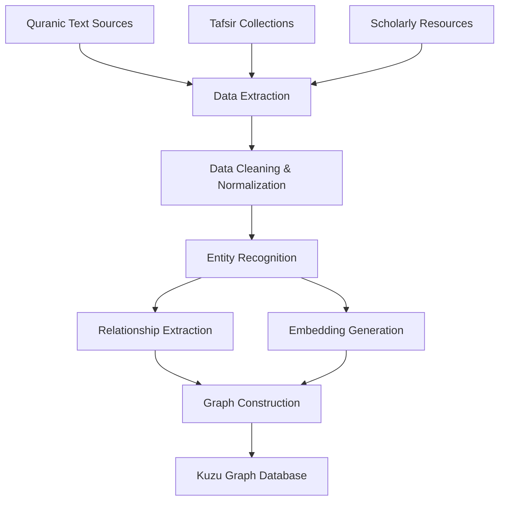
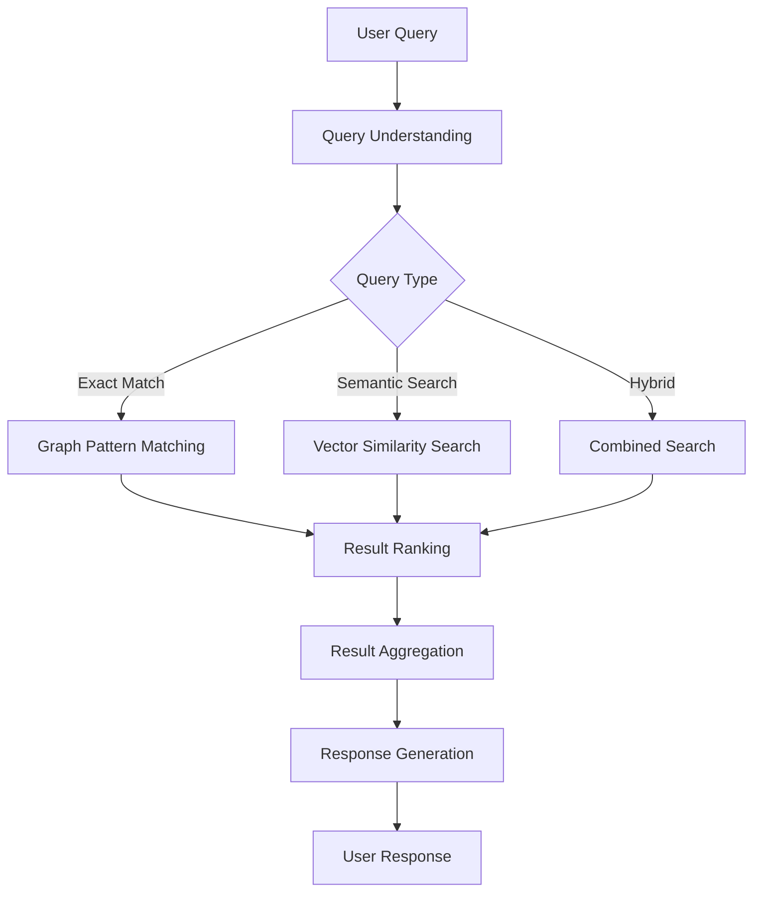

# System Architecture

This page provides a technical overview of the Quran Knowledge Graph architecture for developers who want to understand the system design or contribute to the project.

## Architecture Overview

The Quran Knowledge Graph is built on a hybrid architecture that combines:

1. **Graph Database** - For storing and querying structured relationships
2. **Vector Database** - For semantic similarity search
3. **API Layer** - For unified access to both graph and vector capabilities
4. **Application Layer** - For user-facing interfaces

## Core Components

### 1. Data Storage Layer

#### Graph Database (Kuzu)

We use [Kuzu](https://kuzudb.com/), a high-performance graph database with OpenCypher support, to store and query the complex relationships between Quranic entities.

Key features:
- OpenCypher query language compatibility
- Native vector support
- High-performance query execution
- Flexible schema design

#### Vector Storage

Vector embeddings are stored directly in Kuzu, which supports:
- 768-dimensional embeddings (from BERT-based models)
- Approximate nearest neighbor (ANN) search
- Cosine similarity calculations

### 2. Processing Layer

#### Data Processing Pipeline

The data processing pipeline handles:
- Text normalization and cleaning
- Entity extraction and relationship mapping
- Vector embedding generation
- Graph construction

Technologies used:
- Python for data processing
- Hugging Face Transformers for embedding generation
- Custom NLP pipelines for Arabic text processing

#### Query Processing Engine

The query processing engine:
- Parses natural language queries
- Converts queries to graph patterns and vector searches
- Executes hybrid search operations
- Ranks and aggregates results

### 3. API Layer

The API layer provides:
- RESTful endpoints for common operations
- GraphQL interface for flexible querying
- Authentication and rate limiting
- Caching for performance optimization

Technologies used:
- FastAPI for REST endpoints
- Strawberry for GraphQL
- Redis for caching
- JWT for authentication

### 4. Application Layer

The application layer includes:
- Web interface for end users
- Admin dashboard for content management
- Analytics dashboard for usage insights

Technologies used:
- Next.js for the web interface
- React for UI components
- TailwindCSS for styling
- Vercel for hosting

## Data Flow

### 1. Data Ingestion Flow

### 2. Query Processing Flow

## Technology Stack

### Backend
- **Language**: Python 3.9+
- **Graph Database**: Kuzu
- **API Framework**: FastAPI
- **ML/AI**: PyTorch, Hugging Face Transformers
- **Caching**: Redis
- **Authentication**: JWT, Auth0

### Frontend
- **Framework**: Next.js
- **UI Library**: React
- **Styling**: TailwindCSS
- **State Management**: React Query, Zustand
- **Visualization**: D3.js, React Flow

### DevOps
- **Containerization**: Docker
- **CI/CD**: GitHub Actions
- **Deployment**: Simple containerized deployment

## Performance Considerations

### Query Optimization

- **Indexing Strategy**: Indexes on frequently queried properties
- **Query Caching**: Redis-based caching for common queries
- **Query Planning**: Optimized Cypher query generation

### Scaling Strategy

- **Horizontal Scaling**: Stateless API servers can scale horizontally
- **Database Scaling**: Kuzu supports vertical scaling for increased load
- **Caching Tiers**: Multi-level caching for different query patterns

## Security Architecture

- **Authentication**: JWT-based authentication with Auth0 integration
- **Authorization**: Role-based access control for API endpoints
- **Data Protection**: Encryption at rest and in transit
- **API Security**: Rate limiting, CORS protection, input validation

## Development Environment

To set up a development environment, see the [Getting Started for Developers](/developers/getting-started) guide.

## Further Technical Documentation

For more detailed technical information, see:
- [Graph Database Implementation](/technical/graph-database)
- [Vector Embeddings](/technical/vector-embeddings)
- [Query Optimization](/technical/query-optimization)
- [API Reference](/api-reference/introduction)
