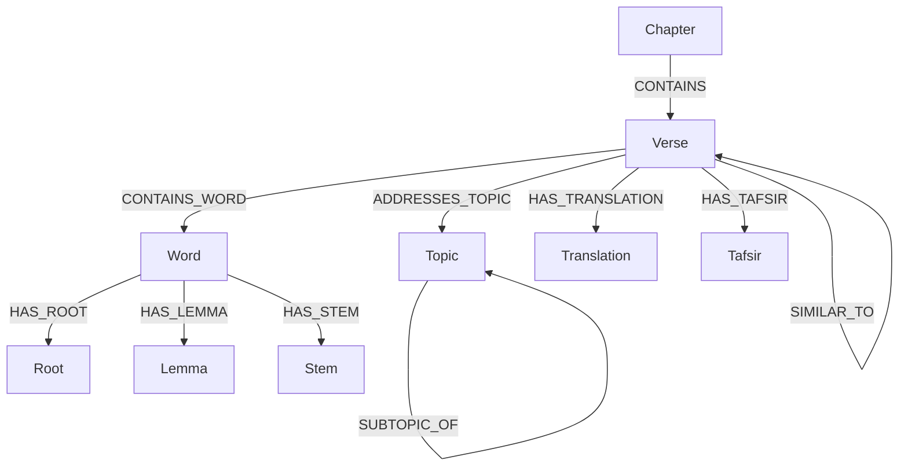

# Quran Knowledge Graph

<Note>
  **Research Preview**: This is an experimental research preview from QuranLabs. For inquiries, please contact Muhammad at muhammad@muhajir.dev.
</Note>

The Quran Knowledge Graph is a comprehensive graph database representation of the Quran that captures the complex relationships between chapters, verses, words, linguistic features, and thematic elements. Using Kuzu as the graph database and incorporating vector embeddings, this project enables powerful semantic search, thematic discovery, and linguistic analysis of the Quranic text.

## Overview

The Quran Knowledge Graph project aims to:

1. Create a rich, interconnected representation of the Quranic text
2. Enable powerful semantic search and thematic exploration
3. Facilitate linguistic analysis and pattern discovery
4. Support scholarly research and personal study
5. Provide a foundation for AI-enhanced Quranic applications

<CardGroup cols={2}>
  <Card title="Products and Use Cases" icon="lightbulb" href="/products/README">
    Explore potential applications and use cases built on the Quran Knowledge Graph
  </Card>
  <Card title="Example Queries" icon="code" href="/queries/README">
    Discover practical query examples for extracting insights from the graph
  </Card>
  <Card title="Scholarly Approaches" icon="book" href="/scholarly_approaches">
    Learn about methodologies inspired by renowned Quranic scholars
  </Card>
  <Card title="API Reference" icon="code" href="/api-reference/introduction">
    Explore the API for integrating with the Quran Knowledge Graph
  </Card>
</CardGroup>

## Key Features

### Graph-Based Representation

The Quran Knowledge Graph represents the Quranic text as a network of interconnected entities and relationships, capturing the rich structure of the text in a way that traditional databases cannot.

### Vector Embeddings

The Knowledge Graph incorporates vector embeddings for verses, words, and topics, enabling semantic search and similarity analysis based on meaning rather than just keywords.

### Thematic Mapping

The graph represents the rich thematic structure of the Quran, allowing users to explore connections between themes, trace concept development, and discover implicit relationships.

### Linguistic Analysis

By connecting words to their roots, lemmas, and stems, the Knowledge Graph facilitates deep linguistic analysis, pattern discovery, and exploration of the Quran's linguistic features.

### AI Enhancement

The Knowledge Graph leverages artificial intelligence to provide deeper insights, generate contextual understanding, and enable more sophisticated analysis of the Quranic text.

## Data Sources

The primary data source for this project is [qul.tarteel.ai](https://qul.tarteel.ai), which provides:

- Quranic text in multiple scripts
- Chapter and verse metadata
- Word-by-word analysis
- Linguistic features (roots, lemmas, stems)
- Thematic classifications

## Getting Started

<CardGroup cols={2}>
  <Card title="Quickstart" icon="bolt" href="/quickstart">
    Get up and running with the Quran Knowledge Graph in minutes
  </Card>
  <Card title="Development" icon="code" href="/development">
    Set up your development environment for contributing to the project
  </Card>
</CardGroup>
